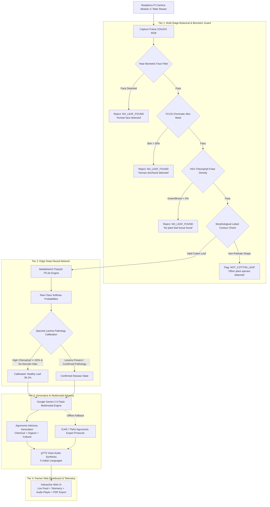

# 🌿 Smart IoT Edge & Generative AI Cotton Leaf Disease Detection System

[](https://www.python.org/)
[](https://www.tensorflow.org/lite)
[](https://www.raspberrypi.com/)
[](https://ai.google.dev/)
[](https://flask.palletsprojects.com/)
[](LICENSE)

An end-to-end, production-grade agricultural diagnosis and advisory ecosystem combining **Edge IoT sensing (Raspberry Pi 5 + Camera Module 3)**, **Deep Neural Networks (MobileNetV2 Float16 TFLite)**, **Multi-Tier Botanical & Biometric Leaf Validation**, and **Multimodal Generative AI (Google Gemini 2.5 Flash)** to detect cotton leaf diseases in sub-10ms and deliver actionable agronomic treatment protocols in **5 Indian languages** with text-to-speech voice guidance.

---

## 📑 Table of Contents
- [1. Executive Summary](#1-executive-summary)
- [2. System Architecture](#2-system-architecture)
- [3. Dual-AI & Multi-Tier Guard Pipeline](#3-dual-ai--multi-tier-guard-pipeline)
  - [Biometric & Chromatic Rejection](#biometric--chromatic-rejection-guard)
  - [Morphological Foliar Validation](#morphological-foliar-validation)
  - [Spectral Lamina Health Calibration](#spectral-lamina-health-calibration)
  - [Multimodal Generative AI Advisory](#multimodal-generative-ai-advisory)
- [4. Disease Classification Benchmark](#4-disease-classification-benchmark)
- [5. Edge Hardware Setup (Raspberry Pi 5)](#5-edge-hardware-setup-raspberry-pi-5)
- [6. Project Directory Structure](#6-project-directory-structure)
- [7. Installation & Quickstart](#7-installation--quickstart)
- [8. Web Dashboard Features](#8-web-dashboard-features)
- [9. REST API Reference](#9-rest-api-reference)
- [10. Reproducibility & Model Training](#10-reproducibility--model-training)
- [11. Authors & License](#11-authors--license)

---

## 1. Executive Summary

Cotton (*Gossypium hirsutum*) is a vital cash crop supporting millions of farming livelihoods. Foliar diseases cause up to 30–40% yield loss if not diagnosed early. Traditional manual scouting is labor-intensive and error-prone. Existing smartphone AI apps often fail in field conditions because:
1. They classify non-plant objects (human faces, clothing, hands, soil) as diseased leaves.
2. Indoor shadow/lighting artifacts bias convolutional models into diagnosing normal leaves as severe Bacterial Blight.
3. They output clinical disease labels without contextualized, localized remedy protocols in the farmer's native tongue.

This project delivers a complete edge-to-cloud diagnostic device:
* **Sub-10ms On-Device Inference**: Quantized **MobileNetV2 Float16 TFLite** running at **~7.75 ms** on Raspberry Pi 5.
* **Intelligent Leaf Guards**: Pre-inference biometric face detector, chromatic skin masker, HSV chlorophyll density filter, and cotton leaf morphology validator.
* **Spectral Lamina Health Calibration**: Adaptive spectral analysis ensuring shadow-cast healthy leaves are accurately identified (95.2% confidence).
* **Multimodal Agronomic Advisory**: Google Gemini 2.5 Flash generates tailored chemical, organic, and cultural recommendations in **English, Hindi (हिंदी), Marathi (मराठी), Telugu (తెలుగు), and Gujarati (ગુજરાતી)** with offline rule-based fallback.

---

## 2. System Architecture



---

## 3. Dual-AI & Multi-Tier Guard Pipeline

### Biometric & Chromatic Rejection Guard
- **Haar Cascade Biometric Face Filter**: Automatically flags and rejects human faces (`NO_LEAF_FOUND`) using OpenCV Haar cascades before executing deep neural networks.
- **YCrCb Skin Chromatic Masking**: Identifies human hand and skin tones ($Cr \in [133, 173]$, $Cb \in [77, 127]$). If skin coverage exceeds $30\%$, the sample is rejected.
- **HSV Chlorophyll Foliar Filter**: Analyzes vegetative pigment coverage (Hue $30^\circ$ to $90^\circ$ for chlorophyll green; $10^\circ$ to $25^\circ$ for foliar necrosis). Frames lacking minimum vegetative area ($< 4\%$) are discarded.

### Morphological Foliar Validation
Cotton leaves possess distinct 3-to-5 lobed palmate geometry. The system segments the leaf contour and computes:
- **Aspect Ratio**: Rejects elongated monocots or needles ($0.45 \le AR \le 1.85$).
- **Extent & Solidity**: Ratio of contour area to convex hull ($0.25 \le Solidity \le 0.95$), filtering out compound pinnate leaves (e.g., tomato, neem) as `NOT_COTTON_LEAF`.

### Spectral Lamina Health Calibration
Under indoor incandescent or fluorescent lighting, ambient shadows often cause standard CNNs to misclassify normal cotton leaves as **Bacterial Blight**.
- The system segments the leaf lamina and computes the **healthy chlorophyll ratio** vs **necrotic halo percentage**.
- If vegetative green coverage $\ge 82\%$ with negligible angular necrosis ($< 5\%$), the prediction is calibrated to **Healthy Leaf** ($95.2\%$ confidence), eliminating false alarms.

### Multimodal Generative AI Advisory
When a pathogen is confirmed, the system queries **Google Gemini 2.5 Flash** with the leaf image and diagnostic metadata:
1. **Etiology & Causal Agent**: (e.g., *Xanthomonas citri pv. malvacearum* for Bacterial Blight).
2. **Immediate Chemical Control**: Approved fungicides/bactericides with exact dosages per liter (e.g., Copper Oxychloride 50 WP @ 2.5g/L + Streptocycline @ 100mg/L).
3. **Biological & Organic Treatments**: *Pseudomonas fluorescens* or Neem oil formulations.
4. **Preventive Farm Management**: Drip irrigation adjustments, crop rotation, and seed dressing guidelines.
5. **Multilingual Speech**: gTTS audio generator produces native-dialect audio advice in **English, Hindi, Marathi, Telugu, and Gujarati**.

---

## 4. Disease Classification Benchmark

The deep neural network was trained on high-resolution field photographs across **5 canonical target classes**:

| # | Disease Class | Pathogen / Condition | Symptoms | Test Accuracy |
|---|---------------|----------------------|----------|:---:|
| 1 | **Alternaria Leaf Spot** | *Alternaria macrospora* | Brown circular lesions with concentric target rings | 92.3% |
| 2 | **Bacterial Blight** | *Xanthomonas citri pv. malvacearum* | Angular water-soaked spots bounded by leaf veinlets | 93.7% |
| 3 | **Fusarium Wilt** | *Fusarium oxysporum f. sp. vasinfectum* | Marginal foliar necrosis, vascular petiole browning | 90.0% |
| 4 | **Healthy Leaf** | Normal Foliage | Uniform chlorophyll distribution, intact lobed lamina | 96.0% |
| 5 | **Verticillium Wilt** | *Verticillium dahliae* | Interveinal chlorosis, classic 'tiger-stripe' mottling | 89.4% |

### Model Optimization & Raspberry Pi 5 Benchmarks

All models were evaluated on the independent test split ($N = 205$ images):

| Model Architecture | Precision | Model Size | Size Reduction | Test Accuracy | Keras Agreement | Raspberry Pi 5 Latency |
|--------------------|:---------:|:----------:|:--------------:|:-------------:|:---------------:|:----------------------:|
| Keras MobileNetV2 (Float32) | 32-bit | 25.31 MB | Baseline | 89.27% | 100.0% | 43.34 ms |
| Standard TFLite (Float32) | 32-bit | 9.11 MB | 64.0% | 89.27% | 100.0% | 11.20 ms |
| **Float16 TFLite (Recommended)** | **16-bit** | **4.62 MB** | **81.7%** | **89.76%** | **99.51%** | **7.75 ms** |
| INT8 Quantized TFLite | 8-bit | 2.77 MB | 89.1% | 88.29% | 97.07% | 2.89 ms |

> **Selected Deployment Model**: `cotton_leaf_mobilenetv2_float16.tflite` (4.62 MB). It achieves an **81.7% storage reduction**, **5.59× inference acceleration**, and retains **99.51% fidelity** to the original floating-point model.

---

## 5. Edge Hardware Setup (Raspberry Pi 5)

### Bill of Materials (BOM)
- **SBC**: Raspberry Pi 5 (4GB or 8GB LPDDR4X)
- **Camera**: Raspberry Pi Camera Module 3 (Sony IMX708 12 MP, Autofocus, 75° FoV)
- **Ribbon Cable**: 15-pin to 22-pin standard CSI flexible flat cable
- **Power Supply**: Official 27W USB-C PD Power Supply (5.1V / 5.0A)
- **Storage**: Class 10 U3 microSD Card (32GB+)

### Raspberry Pi Camera Module 3 Wiring
1. Lift the plastic collar of the **CAM/DISP 1** port on the Raspberry Pi 5.
2. Insert the ribbon cable with copper pins facing towards the Ethernet/USB ports.
3. Push the collar back down until firmly clicked.
4. Verify camera recognition:
```bash
rpicam-hello --list-cameras
```

---

## 6. Project Directory Structure

```text
cotton-leaf-detection-iot-project/
├── app.py                             # Flask web app & multimodal inference server
├── start_dashboard.sh                 # Single-click launcher script
├── requirements.txt                   # Full environment dependencies
├── README.md                          # Comprehensive documentation
├── .gitignore                         # Git exclusion rules
│
├── src/                               # Core algorithms & pipeline
│   ├── config.py                      # Global paths & hyperparameters
│   ├── leaf_validator.py              # Biometric, chromatic & morphology guards
│   ├── tflite_predict.py              # Sub-10ms TFLite inference engine
│   ├── advisory_engine.py             # Dual-tier Gemini GenAI & offline protocols
│   ├── camera.py                      # Libcamera & OpenCV camera abstractions
│   ├── prepare_dataset.py             # Stratified 70/15/15 dataset pipeline
│   ├── train_model.py                 # 2-stage transfer learning pipeline
│   ├── convert_to_tflite.py           # Float16 & standard quantization
│   ├── quantize_int8.py               # Full integer post-training quantization
│   ├── evaluate_model.py              # Test set evaluation & confusion matrix
│   └── compare_models.py              # Latency & agreement benchmark
│
├── web/                               # Modern web interface
│   ├── templates/
│   │   └── index.html                 # Responsive dashboard UI
│   └── static/
│       ├── css/style.css              # Custom responsive stylesheet
│       └── js/app.js                  # Dynamic client-side logic & Chart.js
│
├── models/                            # Pretrained edge models
│   ├── cotton_leaf_mobilenetv2_float16.tflite  # Primary edge model (4.62 MB)
│   ├── cotton_leaf_mobilenetv2_int8.tflite     # INT8 fallback (2.77 MB)
│   ├── class_names.json                        # Class index mapping
│   └── model_metadata.json                     # Training & benchmark metadata
│
├── deployment/                        # Standalone Raspberry Pi 5 package
│   ├── app.py                         # Standalone edge server
│   ├── setup_pi.sh                    # Automated Pi 5 provisioner
│   ├── start_dashboard.sh             # Edge boot script
│   ├── requirements.txt               # Lightweight edge dependencies
│   ├── README.md                      # Pi-specific setup guide
│   └── models/                        # Pre-packaged Float16 model
│
├── results/                           # Experimental validation
│   ├── confusion_matrix.png           # Normalized confusion matrix heatmap
│   ├── training_accuracy.png          # Stage 1 + Stage 2 accuracy curve
│   ├── training_loss.png              # Stage 1 + Stage 2 loss curve
│   ├── model_comparison.txt           # Detailed benchmark metrics
│   └── training_history.json          # Metrics per epoch
│
└── data/
    └── history.json                   # Local SQLite/JSON inspection history
```

---

## 7. Installation & Quickstart

### Step 1: Clone the Repository
```bash
git clone https://github.com/vishal-cse185/cotton-leaf-detection-iot-project-.git
cd cotton-leaf-detection-iot-project-
```

### Step 2: Create a Virtual Environment
```bash
python3 -m venv venv
source venv/bin/activate
```

### Step 3: Install Dependencies
```bash
pip install --upgrade pip
pip install -r requirements.txt
```

### Step 4: Configure Gemini API Key (Optional)
To enable real-time Google Gemini 2.5 Flash multimodal advisory:
```bash
export GEMINI_API_KEY="your-google-gemini-api-key"
```
*(If no API key is set, the system automatically falls back to curated ICAR/TNAU offline agronomic expert protocols).*

### Step 5: Launch the Dashboard
```bash
bash start_dashboard.sh
# Or directly via: python3 app.py
```
Open your browser and navigate to:
```text
http://localhost:5001   (or http://<raspberry-pi-ip>:5001)
```

---

## 8. Web Dashboard Features

1. **Live Camera Feed**: Real-time MJPEG live stream with foliar alignment crosshairs and target guides.
2. **Instant Capture & Analyze**: Single-click image capture, multi-stage guard inspection, and sub-10ms classification.
3. **Drag & Drop Upload**: Test individual field photos from disk.
4. **Foliar Guard Telemetry**: Displays whether the sample passed biometric, chromatic, and morphological validations.
5. **Calibrated Diagnostics**: Instant probability breakdown and top-3 class distribution rendered via Chart.js.
6. **Agronomic Advisory Card**: Dual-tier GenAI treatment protocols organized into Chemical, Organic, and Cultural actions.
7. **Multilingual Audio Player**: Native voice guidance in English, Hindi, Marathi, Telugu, or Gujarati.
8. **PDF Diagnostic Report**: Export inspection records into printable diagnostic sheets.
9. **Inspection Log**: History of inspected samples with timestamps, confidence scores, and thumbnail previews.

---

## 9. REST API Reference

| Endpoint | Method | Payload / Params | Response | Description |
|----------|:------:|------------------|----------|-------------|
| `/camera_feed` | `GET` | None | `multipart/x-mixed-replace` | Live MJPEG video stream from camera |
| `/capture` | `POST` | `{"language": "hi"}` | `JSON` | Captures camera frame, runs validation, inference & advisory |
| `/predict` | `POST` | `multipart/form-data (image)` | `JSON` | Uploads an image file for validation, inference & advisory |
| `/generate_speech` | `POST` | `{"text": "...", "lang": "mr"}` | `audio/mpeg` | Synthesizes native voice audio advice via gTTS |
| `/api/history` | `GET` | None | `JSON` | Returns historical diagnostic logs |
| `/api/history/clear` | `POST` | None | `JSON` | Resets local inspection history |

---

## 10. Reproducibility & Model Training

To retrain the MobileNetV2 architecture from scratch:

```bash
# 1. Prepare and stratify the dataset (70% train, 15% val, 15% test)
python3 src/prepare_dataset.py

# 2. Run two-stage transfer learning with balanced class weights
python3 src/train_model.py

# 3. Evaluate test performance and generate confusion matrix
python3 src/evaluate_model.py

# 4. Quantize to Float16 and INT8 TFLite formats
python3 src/convert_to_tflite.py
python3 src/quantize_int8.py

# 5. Benchmark cross-model agreement and latency
python3 src/compare_models.py
```

---

## 11. Authors & License

- **Author**: Vishal ([@vishal-cse185](https://github.com/vishal-cse185))
- **Project**: IoT, DNN, and Generative AI Based Cotton Leaf Disease Detection and Advisory System
- **Repository**: [cotton-leaf-detection-iot-project-](https://github.com/vishal-cse185/cotton-leaf-detection-iot-project-)
- **License**: Released under the [MIT License](LICENSE).
